A caching proxy reduces bandwidth and improves response times by caching and reusing frequently-requested web pages. To achieve this, it optimises the data flow between client and server to improve performance and caches frequently-used content to save bandwidth. OPNsense is equipped with a fully featured forward caching (transparent) proxy and built-in category based web filter support

First we need to create a Certificate Authority (CA) on our OPNsense firewall instance that will issue and sign security certificates to prove that a website or server is who it says it is, allowing our firewall to safely intercept and inspect encrypted HTTPS traffic.

Go to `System`  ‣ `Trust`  ‣ `Authorities` , press **`+`**  to create a new authority, it will become the root certificate authority.

| **Options** | **Description** |
| --- | --- |
| **Method** | `Create an internal Certificate Authority` |
| **Description** | `OPNsense-WebCertAuthA` (or a custom description) |
| **Key** |     |
| **Key Type** | `RSA-2048` (or higher) |
| **Digest Algorithm** | `SHA256` (or higher) |
| **Issuer** | `self-signed` (root CA is always self-signed) |
| **Lifetime (days)** | `3650` (after this expires the root CA, all its issued intermediate CAs and their issued leaf certificates must be recreated) |
| **General** |     |
| **Country Code** | `Uganda` |
| **State or Province** | `Kampala` |
| **City** | `Can be left empty` |
| **Organization** | `Can be left empty` |
| **Organizational Unit** | `` `Can be left empty` `` |
| **Email Address** | `info@example.com` (your email address, it is best practice to use a real existing one) |
| **Common Name** | `OPNsense-WebCertAuth` (or a custom name) |
| **OCSP URI** | leave empty |

Press **Save** and the root CA has been created. The private and public key are saved on the OPNsense.

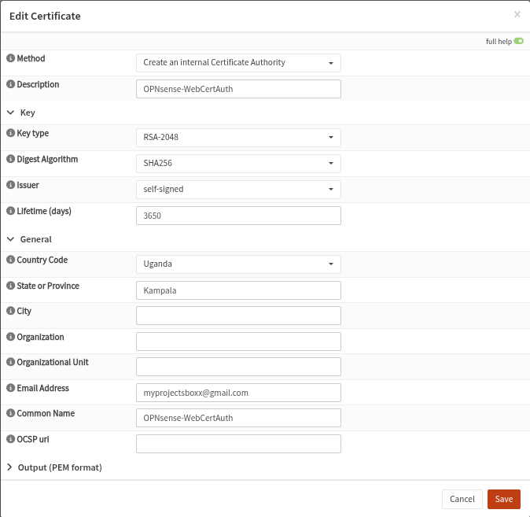

We can proceed to install the CA on our client machines in the virtual lab. To eliminate the need for middleware and ensure consistency, we can login into the GUI directly from each VM and download the CA. Press the download icon and accept the download. (Note: on windows, the certificate might download as PEM file, simply rename it and change ONLY the extension to `.crt`  )

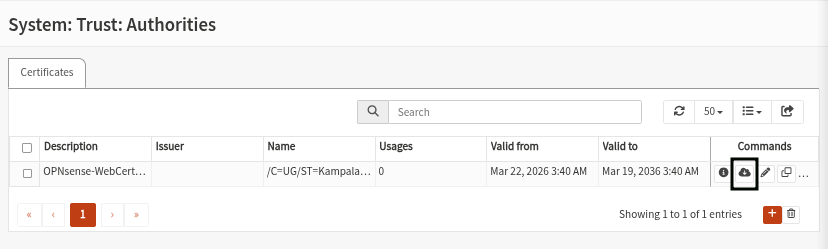

### Installing the certificate on WIndows

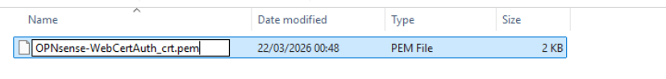

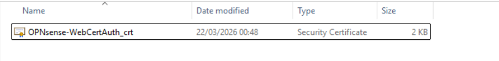

To install the certificate, double click it open the wizard and click \`Install Certificate

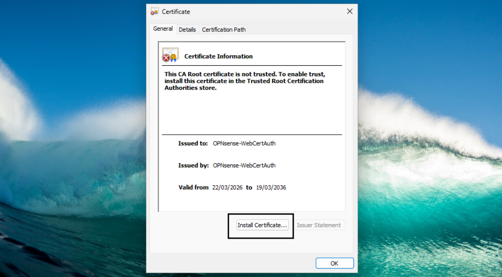

Once the wizard opens select `Local Machine` and Press `Next`

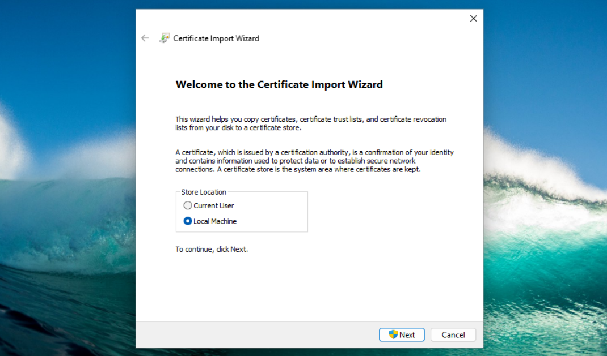

Select `Place all certificates in the following store` , click `Browse` and select `Trusted Root Certification Authorities` in the location dialog box and press `Next`

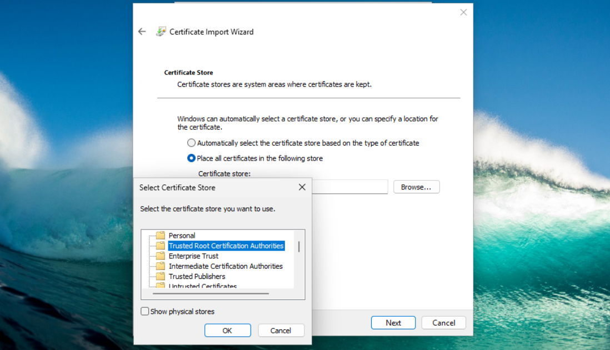

Finally the wizard completion state will appear displaying the summary of the settings, click `Finish`

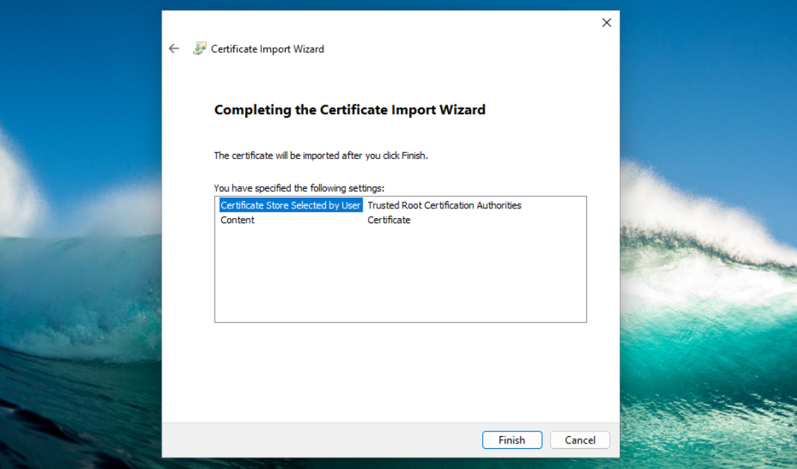

### Installing the certificate on Linux

After logging into the GUI and downloading the certificate, rename it and change the file extension from `.pem`  to `.crt`

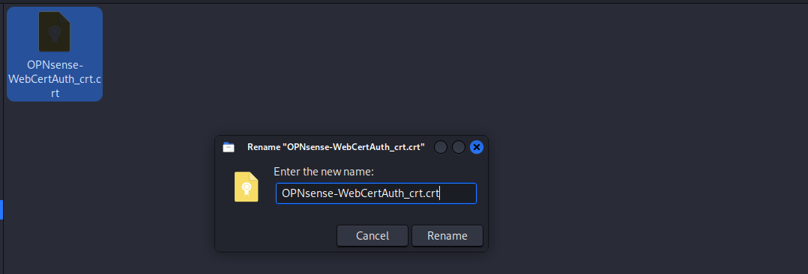

Open the terminal and move it to the trust store using;

`sudo cp /home/kali/Downloads/OPNsense-WebCertAuth_crt.crt /usr/local/share/ca-certificates/`  and refresh the store using `sudo update-ca-certificates`

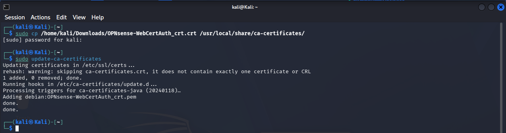

### Enabling the Web Proxy

To enable the proxy just go to `Services`  ‣ `Web Proxy`  ‣ `Administration`  and check **Enable proxy** then click on **Apply**. The default will enable the proxy with User Authentication based on the local user database and runs on port 3128 of the LAN interface.

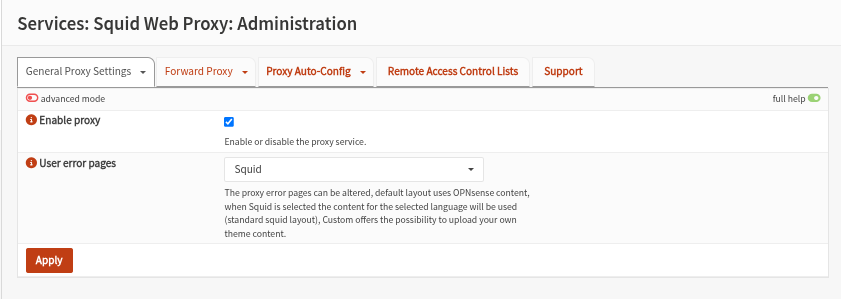

### Setting up the Transparent Proxy

Go to `Services`  ‣ `Web Proxy`  ‣ `Administration`  select **General Forward Settings** under the **Forward Proxy Tab**. Select **Enable Transparent HTTP proxy** And Click **Apply**.

We will need a firewall rule to forward traffic from the firewall to the proxy server. A simple way to add the NAT/Firewall Rule is to click the **(i)** icon on the left of the **Enable Transparent HTTP proxy** option and click on **add a new firewall rule**.

If the shortcut link is missing, navigate to `Firewall`   ‣ `NAT`  ‣ `Destination NAT` , click the `+` Add button at the bottom right and fill in the settings as shown below. (Ensure to create the HTTPS rule as well)

|     |     |
| --- | --- |
| **Interface** | LAN |
| **TCP/IP VERSION** | IPv4 |
| **Protocol** | TCP |
| **Source** | LAN net |
| **Source port range** | any - any |
| **Destination** | any |
| **Destination port range** | HTTP - HTTP |
| **Redirect target IP** | 127.0.0.1 |
| **Redirect target port** | other/3128 |
| **Description** | redirect traffic to proxy |
| **NAT reflection** | Enable |
| **Filter rule association** | Add associated filter rule |

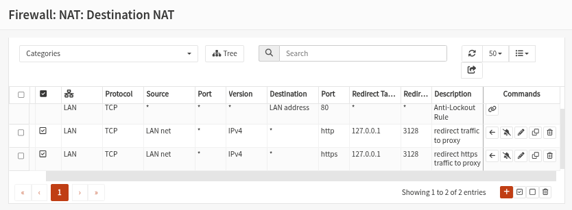

Go to `Services`  ‣ `Web Proxy`  ‣ `Administration`  Then select **General Forward Settings** under the **Forward Proxy Tab**. Select **Enable SSL mode** and set **CA to use** to the CA we created. Then Click **Apply**.

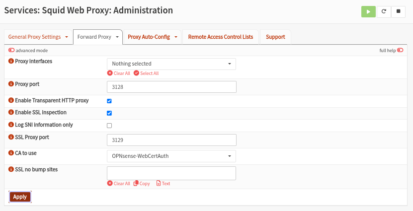

In a production environment we will need to configure `No SSL Bump`  and add sites whose security layer needs to remain intact since they require sensitive information such as banking pages or payment services

**Configuring web filtering**

Category-based web filtering is a security feature that allows the administrator to block or allow entire groups of websites (like "Gambling," "Social Media," or "Malware") by using a pre-made list, rather than manually typing in every single URL yourself.

For this lab I will utilize the [<ins>UT1 “web categorization list”</ins> (](https://dsi.ut-capitole.fr/blacklists/index_en.php)[ftp://ftp.ut-capitole.fr/pub/reseau/cache/squidguard_contrib/blacklists.tar.gz](# "ftp://ftp.ut-capitole.fr/pub/reseau/cache/squidguard_contrib/blacklists.tar.gz")[)](https://dsi.ut-capitole.fr/blacklists/index_en.php%5B%29%5D%28https://dsi.ut-capitole.fr/blacklists/index_en.php%29 "https://dsi.ut-capitole.fr/blacklists/index_en.php%5B)%5D(https://dsi.ut-capitole.fr/blacklists/index_en.php)") from the Université Toulouse

To start go to `Services`  ‣ `Web Proxy`  ‣ `Administration` . Click on the arrow next to the **Forward Proxy** tab to show the drop down menu. Now select **Authentication Settings** and click on **Clear All** to disable user authentication. And click **Apply** to save the change.

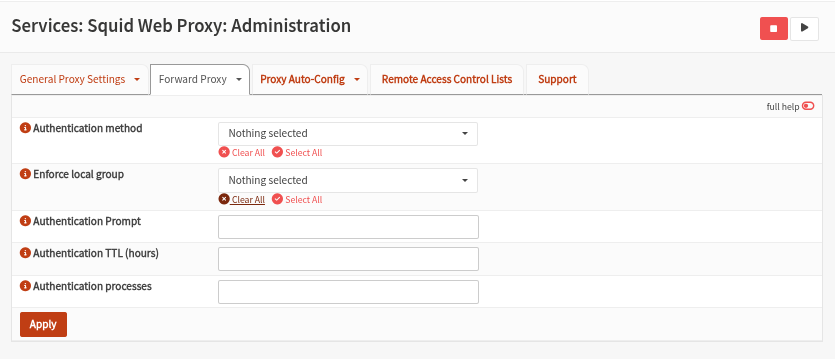

Click on the tab **`Remote Access Control Lists`** . Now click on the **`+`**  in the lower right corner of the from to add a new list and configure it with the following details and Press **`Save Changes`** .

|     |     |     |
| --- | --- | --- |
| **Enabled** | Checked | *Enable/Disable* |
| **Filename** | UT1 | *Choose a unique filename* |
| **URL** | (copy/paste the URL) | *[ftp://ftp.ut-capitole.fr/pub/reseau/cache/squidguard_contrib/blacklists.tar.gz](ftp://ftp.ut-capitole.fr/pub/reseau/cache/squidguard_contrib/blacklists.tar.gz)* |
| **categories** | (Leave blank) | *If left blank the full list will be fetched* |
| **Description** | UT1 web filter | *Your description* |

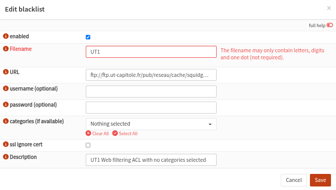

Now press `Download ACLs` , please note that this will take a while (can be several minutes) as the full list (>19 MB) will be converted to squid ACLs.

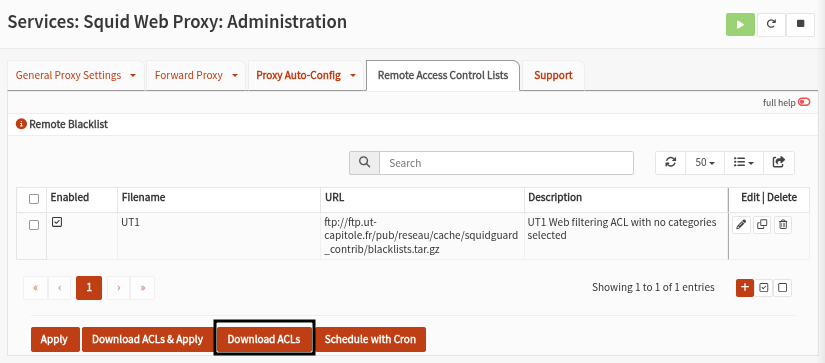

Now we can select the categories we want to use by clicking on the pencil icon next to the description of the list, clear the list and select the desired categories.

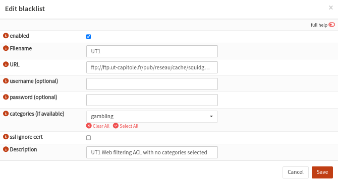

Now **`Save changes`**  and press **`Download ACLs`**  again to download and reconstruct the list with only the selected categories. (This will take roughly the same amount of time as the first fetch)

To make sure no-one can bypass the proxy we need to add a firewall rule. Go to `Firewall`  ‣ `Rules`  and add the following to the top of the list rule on the LAN interface (Do this for both HTTP and HTTPS). **Save** & **Apply changes**

|     |     |
| --- | --- |
| **Action** | Block |
| **Interface** | LAN |
| **Protocol** | TCP/UDP |
| **Source** | LAN net |
| **Destination Port Range** | HTTP |
| **Category** | Block Proxy Bypass |
| **Description** | Block HTTP bypass |

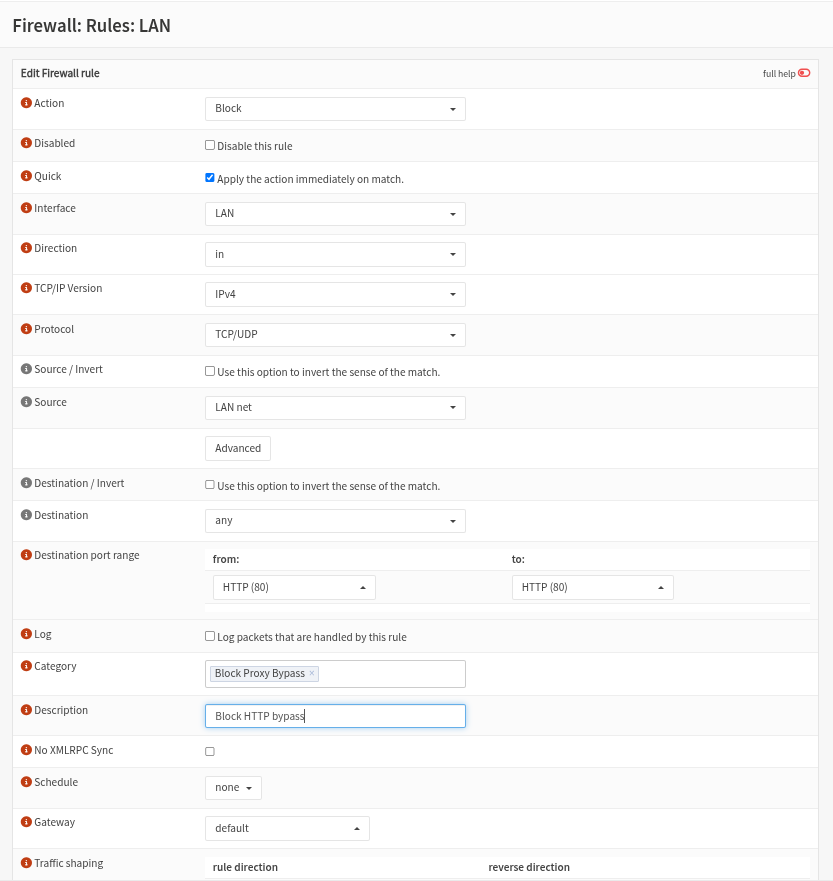

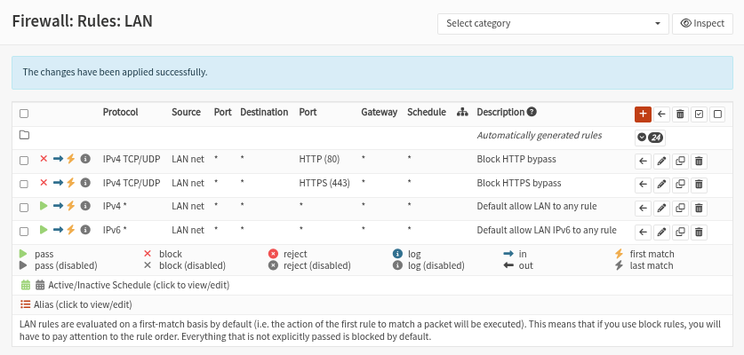
