OPNsense has the powerful feature of setting up a redundant firewall with automatic fail-over option. This feature is referred to as **High Availability** and is made possible by the **Common Address Redundancy Protocol (CARP)** which allows multiple hosts to share the same IP address and Virtual Host ID (VHID) in order to provide *high availability* for one or more services.

This means that one or more hosts can fail, and the other hosts will transparently take over so that users do not see a service failure. However, all fail-safe interfaces should have a dedicated IP address which will be combined with one shared virtual IP address to communicate to both networks.

**CARP**

Common Address Redundancy Protocol uses IP protocol 112, is derived from OpenBSD and uses multicast packets to signal its neighbours about its status. We must ensure that each interface can receive CARP packets. Every virtual interface must have a unique Virtual Host ID (vhid), which is shared across the physical machines. To determine which physical machine has a higher priority, the advertised skew is used. A lower skew means a higher score. (our master firewall uses 0).

**pfSync**

Together with CARP, we can use pfSync to replicate our firewalls state. When failing over we need to make sure both machines know about all connections to make the migration seamless. It’s highly advisable to use a dedicated interface for pfSync packets between the hosts, both for security reasons (state injection) as well as for performance.

When using different network drivers on both machines, like running a HA setup with one physical machine as master and a virtual machine as slave, states can not be synced as interface names differ. The only workaround would be to set up a LAGG.

**XMLRPC sync**

OPNsense includes a mechanism to keep the configuration of the backup server in sync with the master. This mechanism is called XMLRPC sync and can be found under `System`  ‣ `High Availability`  ‣ `Settings` .

Cloning our OPNsense VM.

Since we are using a virtualized instance of OPNsense, the easiest way forward for purposes of this lab would be simply clone our instance. In Virtual Machine Manager, right click the instance and click `Clone`

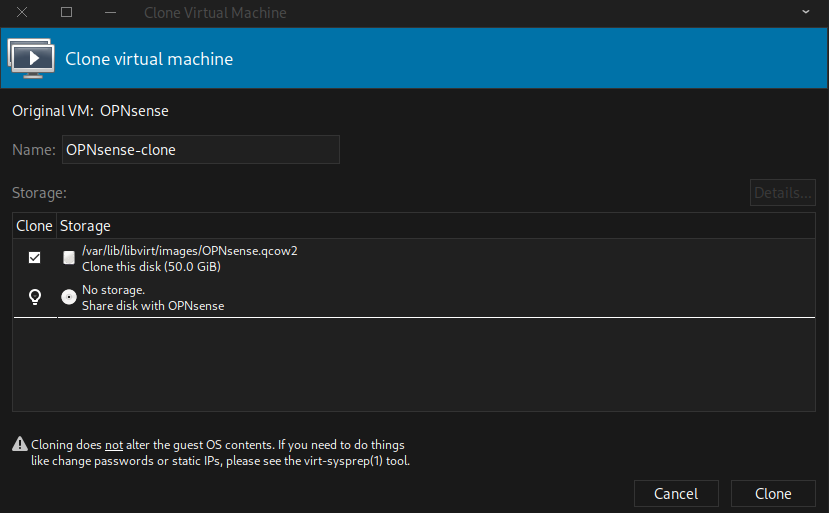

Ensure to keep the first option under the `Storage` tab check so that new storage and MAC address are created for the clone

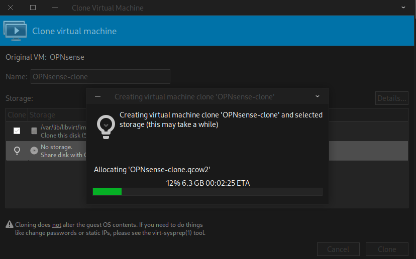

Once created, we can go ahead and rename them appropriately in the `Overview` tab. We can also observe two unique NICs on each VM.

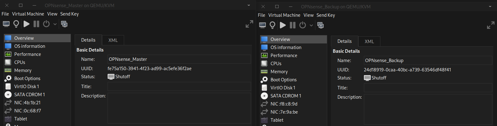

Networking the Master and Backup firewall

We need to create an additional NAT network between our 2 firewalls since CARP and pfSync require a shared layer 2 environment where they can exchange multicast packets for direct communication. In "Routed" mode, our Host machine acts as a router which doesn't handle traffic leading to our VMs not having internet access.

In Virtual Machine Manager, go to `Edit` ‣ `Connection details` and click the `+` button at the bottom to create a new network. Assign the network address and enable DHCP so that it can supply addresses to the WAN interfaces of the firewalls

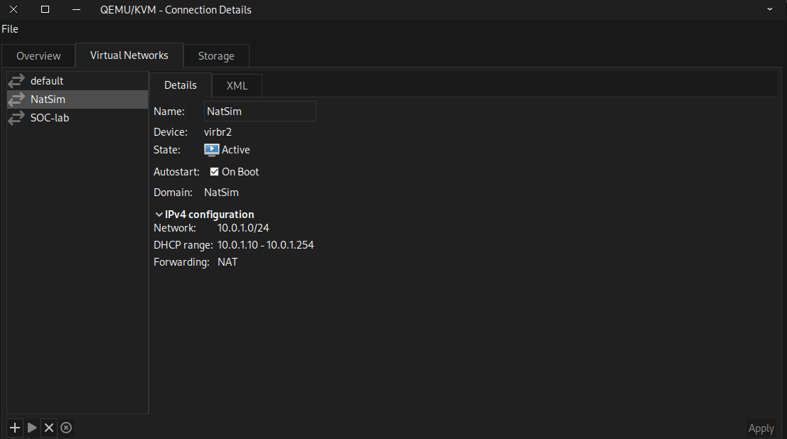

Next we need to connect our firewalls to the NAT network. First we need to ensure that each firewall instance is connected to the NAT network. In Virtual Machine Manager, right click the Master firewall instance and click `Open` then click the lightbulb icon. Change the NIC connection attached to QEMU/KVM's default "NAT mode" and attach it to our new NAT network.

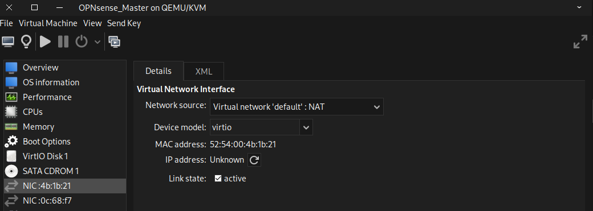

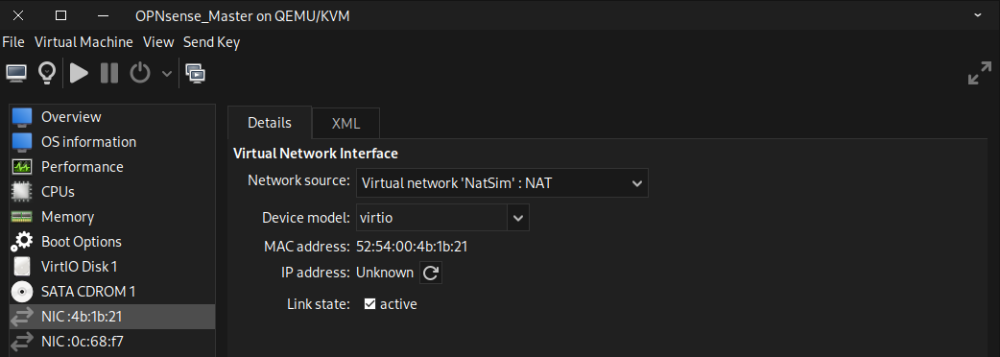

Next add a new NIC to our Master firewall and attach it to our LAN network. Take note of the MAC address and naming schemes in QEMU/KVM are not enabled by default.

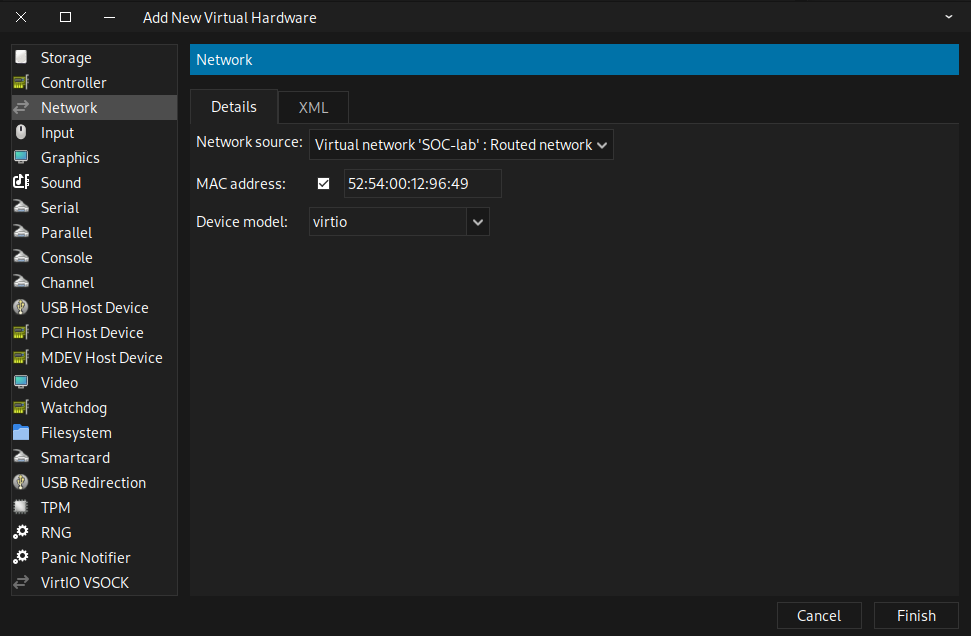

Repeat the above steps for our backup firewall as well.

Next we start up the backup firewall first to avoid IP addressing conflicts with the master firewall. Initially it will boot up with the same address as our Master so we need to change it. To do this, login into the GUI, navigate to `Interfaces` ‣ `[LAN]`  and make sure it's set to "Static IPv4" and assign it a new IPv4 address. Click `Save` and apply changes

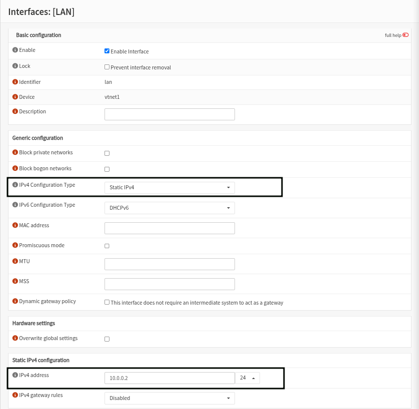

You might have to reboot the backup firewall and it should boot up with the newly assigned IP address

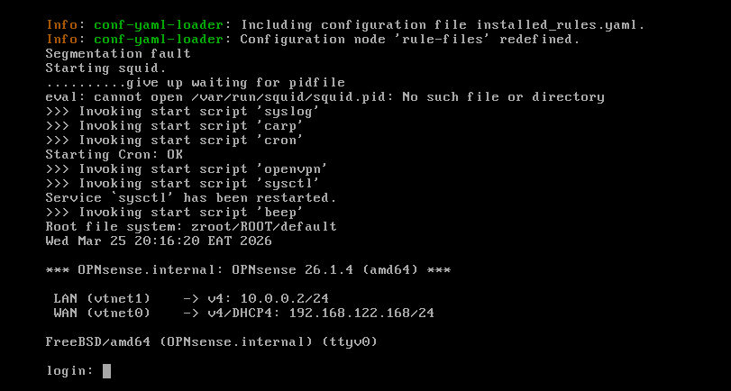

Go ahead and boot up the master firewall instance. Login to the GUI go to `Interfaces`  ‣ `Assignments` and add a description for the interface attached to the third NIC we created earlier and click `Add`. Do this on both firewalls using the GUI

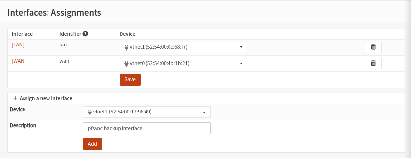

Next go to `Interfaces`  ‣ `[pfsync]` and check `Enable Interface`  and assign it a a completely separate, dedicated subnet that is not used by the LAN or WAN. In this case I used the 10.0.2.0/24 subnet with 10.0.2.1 as my Master and 10.0.2.2 as my backup. Click `Save` and Apply changes.

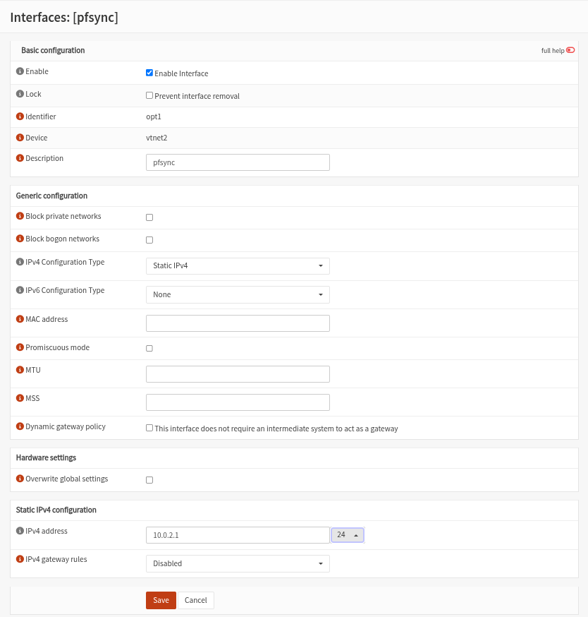

Next we need to make sure the appropriate protocols can be used on the different interfaces, go to `Firewall`  ‣ `Rules` ‣ `pfsync` and make sure both LAN and WAN accept at least CARP packets. Because we’re connecting both firewalls using a direct cable connection, we will add a single rule to accept all traffic on all protocols for that specific interface. Click `Save` and Apply changes. We need to create this rule on both firewalls.

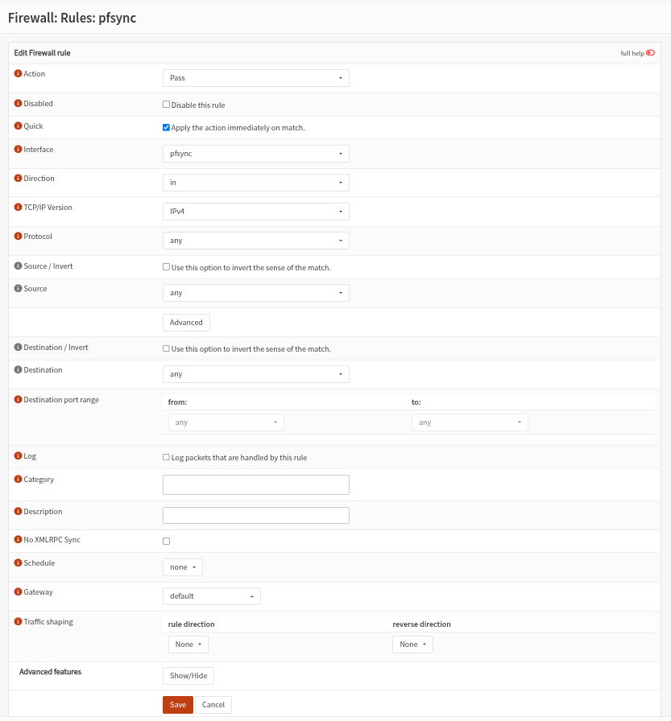

Next, on the master node we are going to setup our Virtual IP addresses, which will also be added to the backup node with a higher skew after synchronisation. Go to `Interfaces`  ‣ `Virtual IPs`  and add a new one with the following settings

|     |     |
| --- | --- |
| Type | Carp |
| Interface | WAN |
| IP addresses | 10.0.1.254 / 24 |
| Virtual password | *\[sabula1\]* |
| VHID Group | 1   |
| Advertising Frequency | Base 1 / Skew 0 |
| Description | Virtual IP WAN |

|     |     |
| --- | --- |
| Type | Carp |
| Interface | LAN |
| IP addresses | 10.0.0.254 / 24 |
| Virtual password | opnsense (the example uses this) |
| VHID Group | 3   |
| Advertising Frequency | Base 1 / Skew 0 |
| Description | Virtual IP LAN |

It is good practice to create Carp Virtual IPs with the same subnet mask as its parent interface. If the parent interface is `/24`, your Carp VIP should also be `/24`.

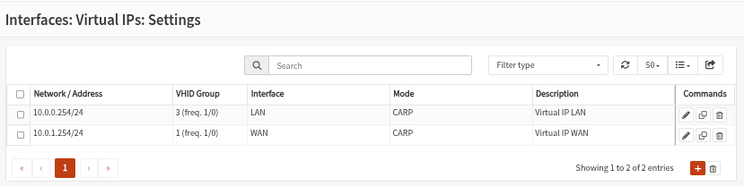

We need to replicate the same setup on our backup firewall this time with a higher skew of 100

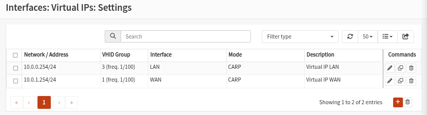

We also need to setup outbound NAT because traffic going out of the firewall should also use the virtual IP address on the WAN interface to make seamless transitions possible.The default NAT configuration is for OPNsense is to use Automatic outbound NAT rule generation using the WAN interface’s IP address for outgoing connections which will not allow seamless transitions unless changed to the WAN Virtual IP.

Go to `Firewall`  ‣ `NAT`  ‣ `Outbound`. Choose manual outbound nat rule generation.

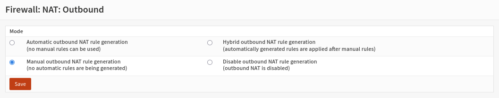

On this page create the a rule originating from the 10.0.0.0/24 network (LAN Network) to use the CARP virtual interface (10.0.1.254/24). The rule should contain the following:

|     |     |
| --- | --- |
| Interface | WAN |
| Source address | LAN net (10.0.0.0/24) |
| Translation / target | 10.0.1.254/24 (CARP virtual IP WAN) |

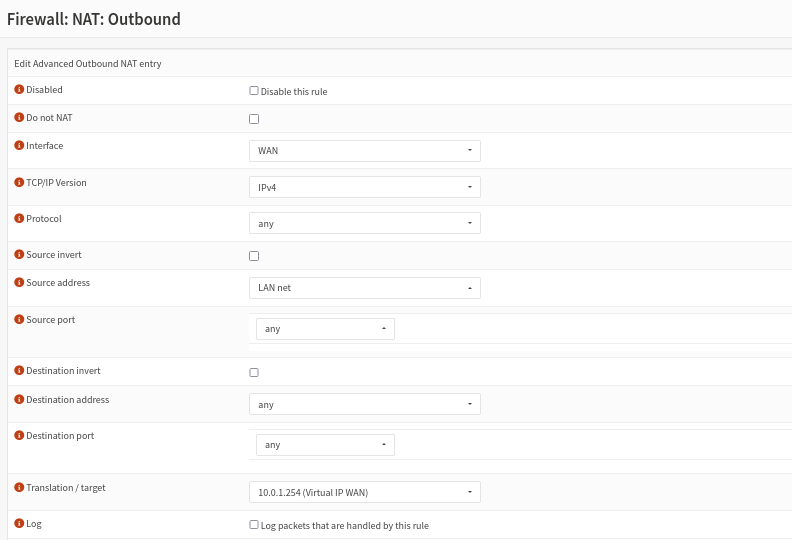

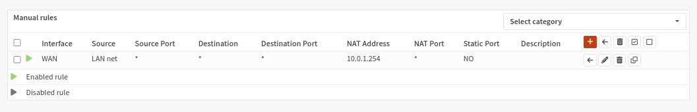

Next we need to setup pfSync and HA sync (xmlrpc) by first configuring pfSync to synchronize the connection state tables and HA sync (xmlrpc) on the master firewall. Go to `System`  ‣ `High Availability`  ‣ `Settings`  and enable pfSync by selecting pfsync from the Synchronize all states via dropdown and enter the peer IP (10.0.2.2) in the field Synchronize Peer IP.

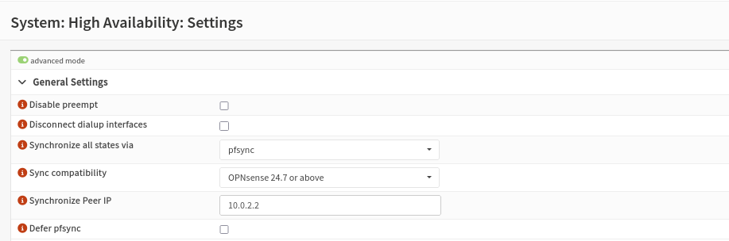

To synchronize the configuration settings from the master to the backup firewall, we setup the XMLRPC sync. In the Synchronize Config to IP field we enter the peer IP (10.0.2.2) of the pfsync interface again to keep this traffic on the direct connection between the two firewalls. Now we need to enter the remote user name and password and configure the services we want to duplicate to the backup server(I have selected all for the sake of the lab). Click `Save`

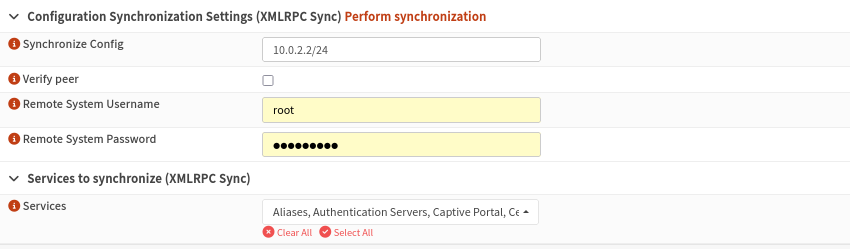

After this we configure pfSync on the backup firewall. Go to `System`  ‣ `High Availability`  ‣ `Settings`  and enable pfSync by activating the Synchronize States checkbox, selecting pfsync for the Synchronize Interface and enter the master IP (10.0.2.1) in the field Synchronize Peer IP. Do not configure XMLRPC sync on the backup firewall.

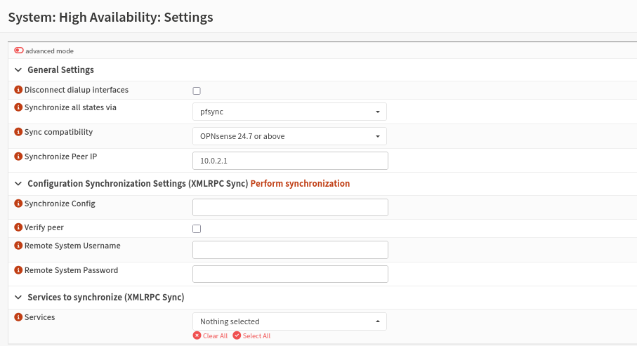

Just to make sure all settings are properly applied, reboot both firewalls before testing. Then go to `System`  ‣ `High availability`  ‣ `Status`  in the OPNsense GUI and check if both machines are properly initialized. (It is normal that the "Backup firewall is not accessible" error only appears on the **Backup's** GUI since the Backup is not configured to reach back and sync the Master

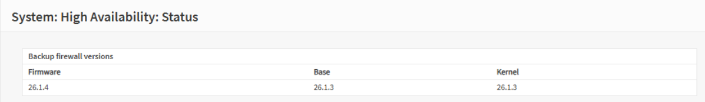

To test our setup, we can simulate hardware failure by simply shutting down our Master firewall. Once it is off, in the backup OPNsense GUI go to `Interfaces`  ‣ `VIP` ‣ `Status` . It should now say MASTER.

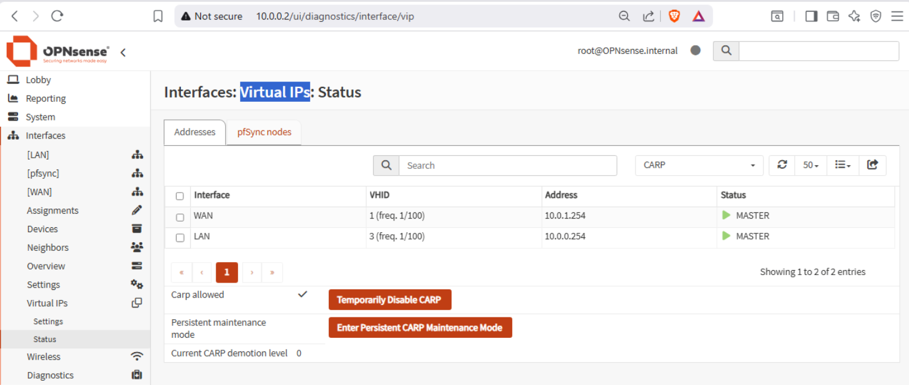
