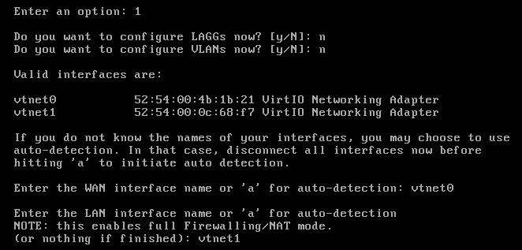
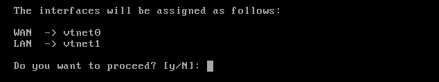
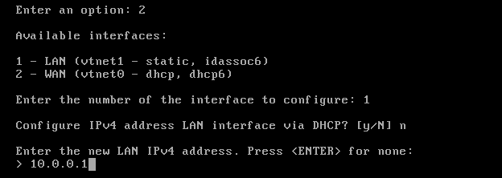
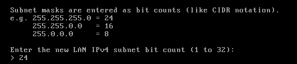
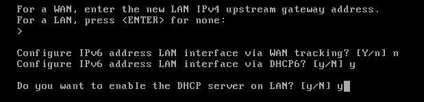
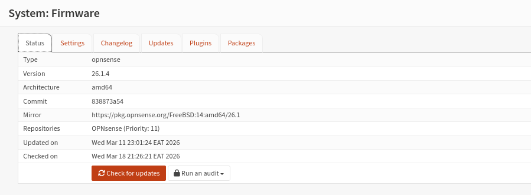
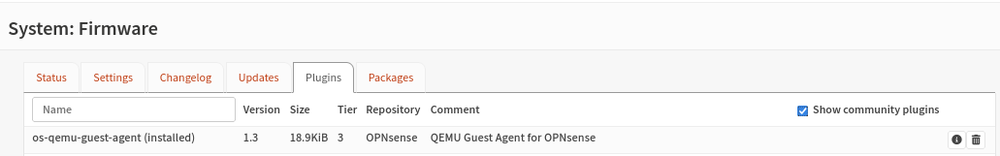

## <ins>Initial Configuration</ins>

After installation, the system will prompt you for the interface assignment. Select option 1 on the console menu

- Link Aggregation Group (LAGG)/CIsco EtherChannel : is a way to "bundle" multiple physical network interfaces into a single logical interface. In OPNsense/FreeBSD, this is used to increase bandwidth and provide redundancy. We select `No/N`
- Virtual Local Area Network: is a way to logically segment the network on switches. We select `No/N` for now

The first interface is the WAN interface. Type the appropriate interface name, in this case `vtnet0` . The second interface is the LAN interface. Type the appropriate interface name, e.g. `vtnet1`



Possible additional interfaces can be assigned as OPT interfaces. If you assigned all your interfaces you can press `[ENTER]` and confirm the settings.



To configure our lab network, select **Option 2** (Set interface IP addresses), choose the **LAN** interface, and select **No** for DHCP to assign a static IP address within the **10.0.0.0/24** range (using subnet mask 255.255.255.0).





Press \[ENTER\] to skip the LAN prompt, and Select `No/N` for the IPV6 configurations and `Yes/Y` for the DHCP server prompt




Using a start address higher than `.2` for our DHCP server for client addresses is a "best practice" in networking because it leaves a small block of addresses open for **static devices** that should never change their IP.  **Start Address:** `10.0.0.10` - **End Address:** `10.0.0.254`


Leave the web GUI protocol as HTTPS by selecting `Yes/y` and `Yes/y` to restore the web GUI access defaults


## Troubleshooting tips

To successfully network your SOC lab on **Parrot OS** using **KVM/Libvirt**, you essentially need to transform your host's virtual bridge into a "dumb switch" so that **OPNsense** can act as the sole commander of the `10.0.0.0/24` network.

### **1\. The Physical Layer (The "Virtual Wire")**

Before checking IP addresses, ensure the VMs are actually plugged into the correct "socket."

`sudo virsh domiflist <VM_Name>` to confirm what virtual bridge each VM is connected to

**OPNsense** must have two interfaces: one on `default` (WAN) and one on `SOC-lab` (LAN).

**Kali/Windows VMs** must only be on `SOC-lab`.

If a VM is on the wrong network, change its source in `virt-manager` or move the `vnet` interface manually with `sudo ip link set vnetX master virbr1`.

### **2\. The Conflict Layer (Host vs. Firewall)**

Libvirt often assigns the host's bridge (`virbr1`) an IP address like `10.0.0.254`. This creates a "Two-Headed" network where the host and the firewall compete for control. Signs include intermittent pings, routing loops, or not being able to reach the OPNsense GUI.

Strip the IP from the host bridge to make it "silent" using

``` bash
sudo ip addr del 10.0.0.254/24 dev virbr1
```

### **3\. The DHCP/Identity Layer**

If the VMs have no IP or an old `192.168.x.x` address, they aren't "talking" to the OPNsense DHCP server.

Use `nmcli`  for  Kali to force a refresh since `dhclient` may be missing:

``` bash
sudo nmcli device disconnect eth0
sudo nmcli device connect eth0
```

And for the windows VMs:

``` bash
ipconfig /release
ipconfig /renew
```

**The Manual Bypass:** If DHCP fails, set a temporary static IP on Kali (`10.0.0.10`) just to log into the OPNsense GUI at `10.0.0.1` and fix the service settings.

Once we have access to the GUI, an update can be done via `System` ‣ `Firmware` ‣ `Updates`.




Since we are in a virtualized environment we need to ensure that the virtualization software tools are installed. To install QEMU Guest Agent, go to `System` ‣ `Firmware` ‣ `Plugins` (tick **Show (Tier 3) community plugins**) and install **os-qemu-guest-agent** by clicking on the **+** sign next to it.



