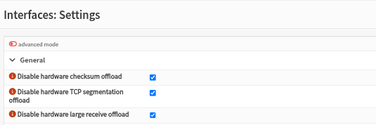
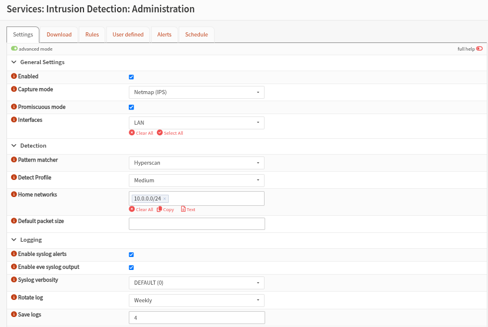
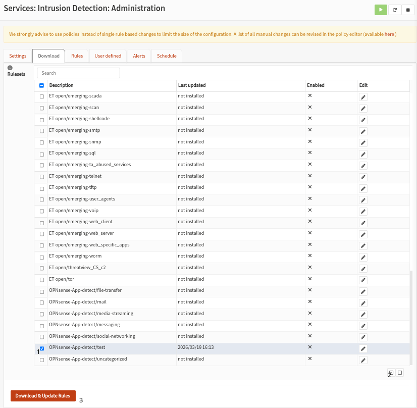
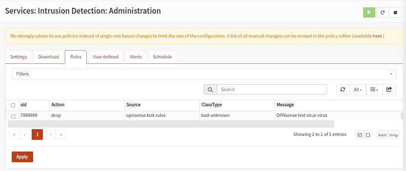
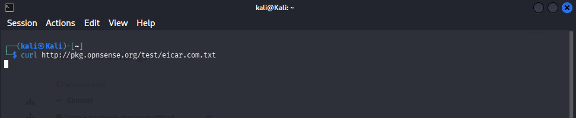
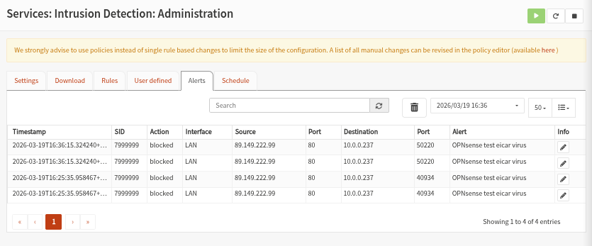

The Intrusion Prevention System (IPS) system of OPNsense is based on [Suricata](https://suricata.io/) and utilizes [Netmap](https://www.freebsd.org/cgi/man.cgi?query=netmap&sektion=4&manpath=FreeBSD+12.2-RELEASE+and+Ports) to enhance performance and minimize CPU utilization.

An *Intrustion Detection System* (IDS) watches network traffic for suspicious patterns and can alert operators when a pattern matches a database of known behaviors.

An *Intrusion Prevention System* (IPS) goes a step further by inspecting each packet as it traverses a network interface to determine if the packet is suspicious in some way.

The [Suricata](https://suricata.io/) software can operate as both an IDS and IPS system.

## General setup

Disable all Hardware Offloading Under `Interfaces`  ‣ `Settings`

|     |     |
| --- | --- |
| **GENERAL SETTINGS** |     |
| Enabled | Enable Suricata |
| Capture mode | Select `Netmap (IPS)` to enable 'In-Line' protection, allowing Suricata to sit directly in the traffic path to instantly drop malicious packets before they reach their destination. |
| Promiscuous mode | Enable this to allow the interface to 'listen' to all traffic on the wire, even if the packets aren't addressed to the firewall itself. |
| Interfaces | For lab case we limit the scope to our `LAN` |
| **DETECTION** |     |
| Pattern matcher | Hyperscan is the fastest and most efficient choice for modern processors. |
| Detection profile | This is a performance setting that tells the firewall how many security rules to keep in active memory. Select `Medium` for a balanced setup and preventing SURICATA from overwhelming our host resources |
| Home networks | We specify our LAN network address (10.0.0.0/24) |
|     |     |
| Enable syslog alerts | Enable this to send a copy of our security alerts to the OPNsense system log using fast log format allowing other tools or dashboards to "see" the threats Suricata is detecting. |
| Enable eve syslog output | Enable this to send high-detail, JSON-formatted security alerts to the system log, providing a richer data source for SIEM tools to analyze while maintaining the firewall's internal logging. |
| Rotate log | Log rotating frequency, also used for the internal event logging (see Alert tab) |
| Save logs | Number of logs to keep |

Click `Apply` to save the settings

### Testing the detection system

Suricata has an inbuilt test rule which we can use to test if our IPS is running properly. Navigate to  `Services`  ‣ `Intrusion Detection`  ‣ `Administration`  and select the `Download` tab. Scroll to the botton and select **OPNsense-App-detect/test,** click the `enable` button and finally click `Download & Update Rules` to download the rule.

The downloaded rule should now appear under the `Rules` tab

On our kali VM, we use the curl command `curl http://pkg.opnsense.org/test/eicar.com.txt` to trigger the rule

Under the `Alerts` tab we can see the table has been populated with blocked traffic

